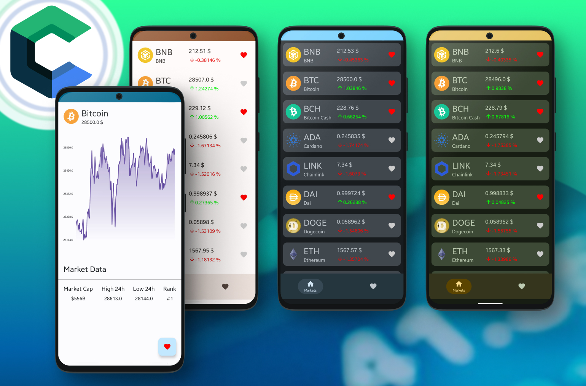
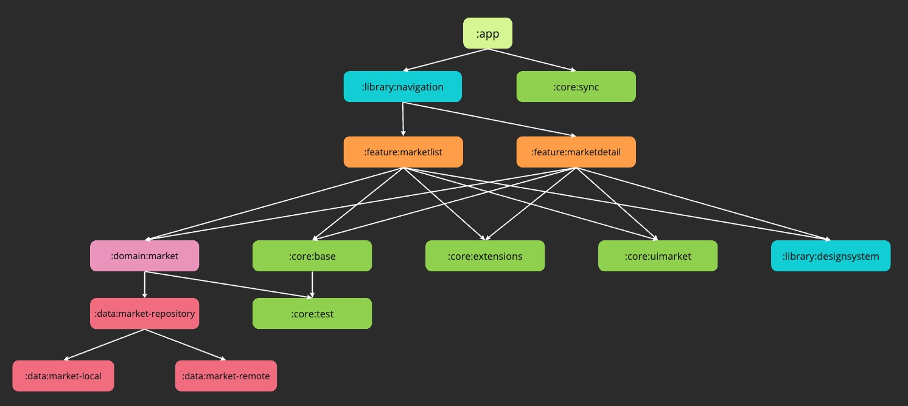
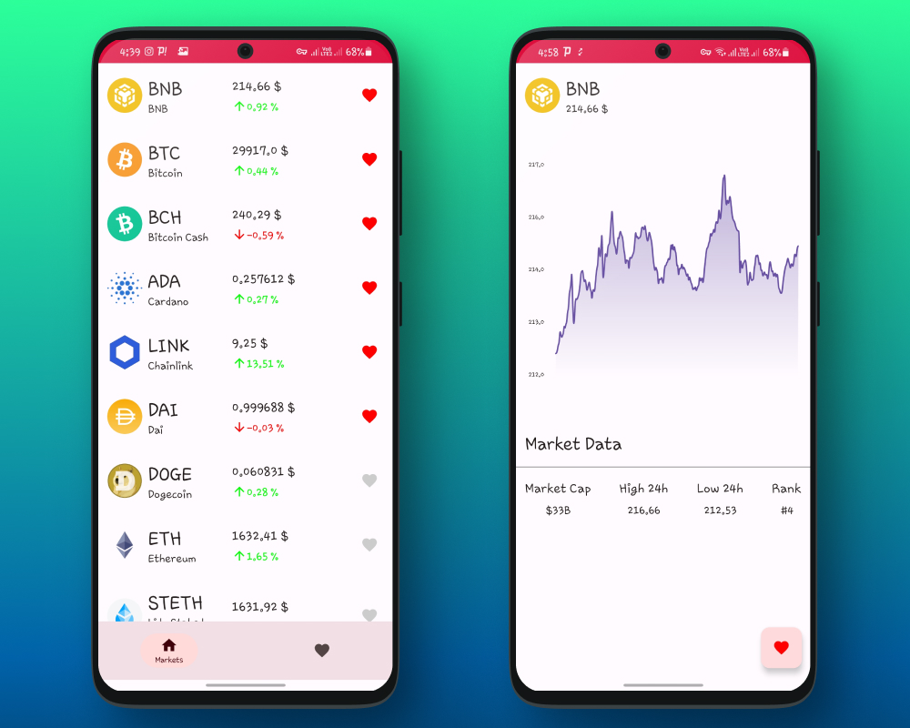
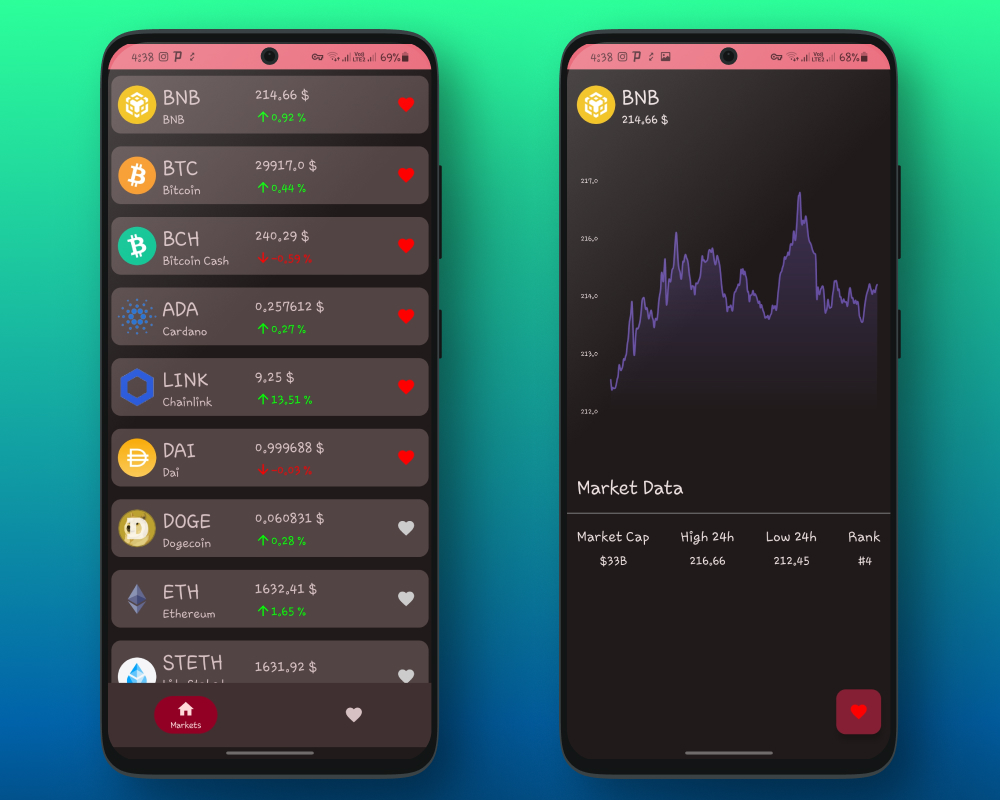
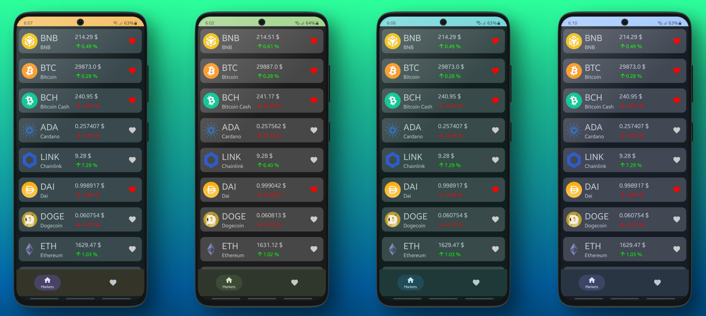
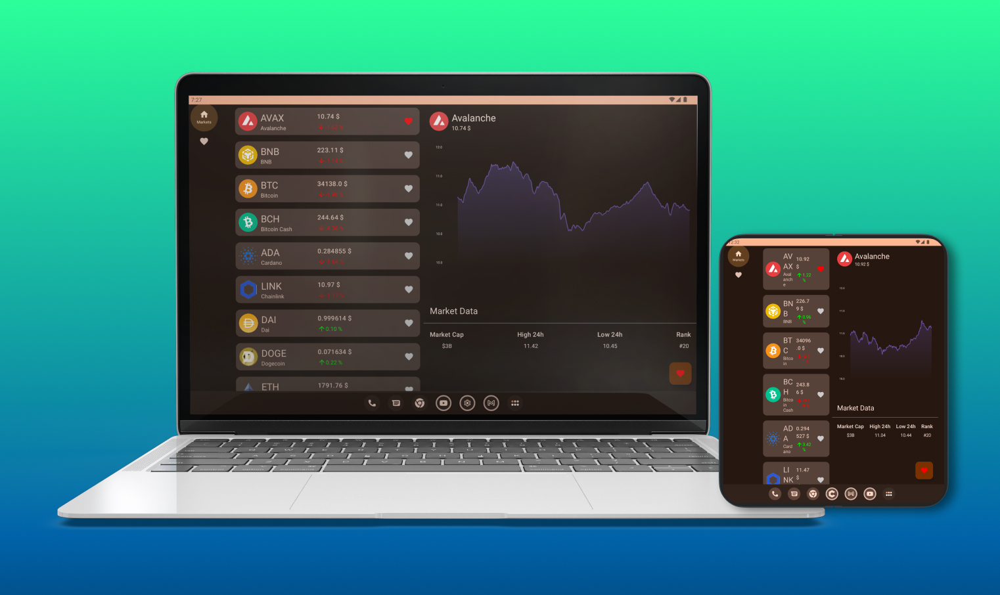

# AudioQuiz

users-data  (Main collection containing the data of all users with one document per user)
|
├── $userId (Document)  (Document ID is the user's ID)
|     |
|     ├── Fields (UserProfile)
|     |     ├── lastUpdated: long
|     |     ├── userId: string
|     |     ├── username: string
|     |     ├── profileImage: string
|     |     └── dateCreated: long
|     |
|     ├── SUB-COLLECTION: general_stats
|     |     |
|     |     └── $documentId (Document)
|     |           ├── Fields (GeneralStats)
|     |           |     ├── id: string
|     |           |     ├── lastUpdated: Date
|     |           |     ├── userLevel: int
|     |           |     ├── numberOfLives: int
|     |           |     ├── numberOfQuizzes: int
|     |           |     ├── numberOfQuestions: int
|     |           |     ├── totalScore: int
|     |           |     ├── averageScore: double
|     |           |     ├── currentStreak: int
|     |           |     └── longestStreak: int
|     |           └── lastQuizDate: Date
|     |
|     ├── SUB-COLLECTION: category_stats
|     |     |
|     |     └── $documentId (Document)
|     |           ├── Fields (CategoryStats)
|     |           |     ├── id: string
|     |           |     ├── lastUpdated: Date
|     |           |     ├── soundWavesStats: CategoryStatsData
|     |           |     ├── synthesisStats: CategoryStatsData
|     |           |     ├── productionStats: CategoryStatsData
|     |           |     ├── mixingStats: CategoryStatsData
|     |           |     ├── processingStats: CategoryStatsData
|     |           |     ├── musicTheoryStats: CategoryStatsData
|     |           |     ├── pitchStats: CategoryStatsData
|     |           |     └── intervalStats: CategoryStatsData
|     |           |     
|     |           ├── Fields (CategoryStatsData)
|     |           |     ├── categoryIndex: int
|     |           |     ├── categoryName: string
|     |           |     ├── lastUpdated: Date
|     |           |     ├── currentChapter: int
|     |           |     ├── numberOfQuizzes: int
|     |           |     ├── totalQuestionsLearn: int
|     |           |     ├── correctAnswersLearn: int
|     |           |     ├── totalQuestionsCompetitive: int
|     |           |     └── correctAnswersCompetitive: int
|     |           └── totalTimeSpent: double
|     |
|     ├── SUB-COLLECTION: frequency_stats
|     |     |
|     |     └── $documentId (Document)
|     |           ├── Fields (FrequencyStats)
|     |           |     ├── id: string
|     |           |     ├── lastUpdated: Date
|     |           |     ├── pitchScoresMap: Map<String, PitchStats>
|     |           |     └── intervalScoresMap: Map<String, IntervalStats>
|     |           |     
|     |           ├── Subfields (PitchStats)
|     |           |     ├── id: string
|     |           |     ├── lastUpdated: Date
|     |           |     ├── frequency: string
|     |           |     ├── totalQuestions: int
|     |           |     ├── correctAnswers: int
|     |           |     └── mistakes: Map<String, Integer>
|     |           |     
|     |           └── Subfields (IntervalStats)
|     |                 ├── id: string
|     |                 ├── lastUpdated: Date
|     |                 ├── intervalName: string
|     |                 ├── baseFrequency: int
|     |                 ├── totalQuestions: int
|     |                 └── correctAnswers: int
|     |                 └── mistakes: Map<String, Integer>
|     |
|     └── SUB-COLLECTION: weekly_scores
|           |
|           └── $documentId (Document)
|                 ├── Fields (WeeklyScores)
|                 |     ├── id: string
|                 |     ├── lastUpdated: Date
|                 |     ├── dailyScores: Map<String, Integer>
|                 └── totalLast7Days: int
|
rank-data (collection used to fetch leaderboard data in batches like top 30 performers)
|
├── $userId (Document)
|     |
|     ├── Fields (RankEntry)
|     |     ├── lastUpdated: long
|     |     ├── userId: string
|     |     ├── username: string
|     |     ├── profileImage: string
|     |     ├── totalScore: int
|     |     ├── averageScore: double
|     |     └── weekScore: int (user's score in the last 7 days)
|     |

we will use the login feature as an example to create the structure:

so, we have the :app  module with main activity, application class, navigation, navhostfragment...
then,
':feature:login' has the following directories and classes:::
/di
LoginFragmentModule.java
/domain
LoggedInUserView.java
LoginResult.java
LoginViewContract.java
/presentation
//navigation
LoginCoordinatorEvent.java
LoginFlowCoordinator.java
LoginNavigation.java
/view
LoginFragment.java
SignupFragment.java
/viewmodel
LoginViewModel.java
SignupViewModel.java
SimpleTextWatcher.java

and the doimain related classes for login logic:

--Result
--AccessToken
--LoggedInUser
--Session
--UserProfile
--LoginType
/repository
--AuthRepository
/use_case
--UserAuthUseCaseFacade
--LoginUserUseCaseImpl
--SendPasswordResetEmailUseCase_Impl
--UserAuthUseCaseFacadeImpl

and finally the data related classes to authentication:
AuthRepository.java
AuthCache.java
UserAuthDao.java
AppDatabase.java
AuthDataSource.java
GoogleSignInDataSource.java
UserProfileDataSource.java
UserProfileDto.java
AuthProvider.java
AuthorizationGatewayImpl.java
AuthService.java
GoogleSignInService.java

so using the summary we currenlty have, write the module/directory structure graph

text:
"S.O.L.I.D. Principles

Single Responsibility Principle (SRP):

A class should have only one reason to change, focusing on a single responsibility or actor.
Ensures cohesion and isolates different concerns.
Open-Closed Principle (OCP):

Software entities should be open for extension but closed for modification.
Encourages adding new functionality through extensions rather than altering existing code, reducing regression bugs and merge conflicts.
Liskov Substitution Principle (LSP):

Derived classes must be substitutable for their base classes without altering the correctness of the program.
Avoids tight coupling by favoring composition over inheritance.
Interface Segregation Principle (ISP):

Clients should not be forced to depend on interfaces they do not use.
Smaller, more specific interfaces are preferred over large, general ones.
Dependency Inversion Principle (DIP):

High-level modules should not depend on low-level modules; both should depend on abstractions.
Decouples components by relying on abstractions rather than concrete implementations.
Key Insights on OCP

Avoid Modifying Existing Code: The goal of OCP is to extend functionality without modifying existing code. This prevents the introduction of bugs and keeps changes isolated.

Violation of Principles Impacting OCP:

LSP Violation: Incorrect inheritance can force modifications in parent classes when adding subclasses.
SRP Violation: Classes with multiple responsibilities may require changes affecting other areas, violating OCP.
DIP Violation: Concrete dependencies can lead to extensive recompilations when modifications are made.
ISP Violation: Large interfaces can force changes in unrelated code, impacting OCP.
Flag Arguments and Enums: Using flags or enums to alter behavior can lead to modifications that break OCP. Instead, use specific methods or functions to maintain compliance with OCP.

Modularization Strategies

Package by Layer:

Splits codebase into layers (Presentation-Domain-Data).
Cons: Often results in large modules that are prone to frequent changes, which can violate SRP, OCP, and other principles.
Pros: Simplifies initial modularization but lacks reusability and can lead to difficulties in managing changes across layers.
Package by Feature:

Organizes codebase by features, isolating changes to individual modules.
Pros: Enhances maintenance and modular independence, supporting parallel compilation and reducing team conflicts.
Cons: Can lead to large modules combining UI and business logic, and might create dependency issues between feature modules.
Package by Component:

Divides codebase into UI modules and component modules (domain + data), guided by use cases.
Pros: Provides reusability, maintains separation of concerns, and supports parallel compilation. Reduces recompilation needs by isolating frequently changing UI code from stable domain logic.
Cons: Requires careful management of shared code between modules but is effective for UI-heavy projects.
Summary

SRP: Focus on single responsibilities to ensure cohesion.
OCP: Design for extension without modification to avoid regression.
LSP: Favor composition over inheritance to prevent tight coupling.
ISP: Use focused, specific interfaces to avoid unnecessary dependencies.
DIP: Depend on abstractions to reduce coupling between components.
Modularization Approach:

Package by Layer: Often unsuitable due to large modules and frequent changes.
Package by Feature: Good for maintenance but may face issues with reusability and large, complex modules.
Package by Component: Optimal for UI-heavy projects, supporting reusability and minimizing recompilations."

repeat this, but instead of having everything in the feature module, have separate modules dedicated to core logic such as as local data, remote, api etc:
:feature:login
├── di 
│└── LoginFragmentModule.java
├── domain
│ ├── model
│ │ ├── AccessToken.java
│ │ ├── LoggedInUser.java
│ │ ├── LoginType.java
│ │ ├── Result.java
│ │ ├── Session.java
│ │ └── UserProfile.java 
│ ├── repository 
│ │ └── AuthRepository.java
│ └── use-case 
│ ├── UserAuthUseCaseFacade.java
│ ├── LoginUserUseCaseImpl.java 
│ ├── SendPasswordResetEmailUseCaseImpl.java 
│ └── UserAuthUseCaseFacadeImpl.java 
├── presentation
│ ├── navigation 
│ │ ├── LoginCoordinatorEvent.java 
│ │ ├── LoginFlowCoordinator.java 
│ │ └── LoginNavigation.java 
│ ├── view 
│ │ ├── LoginFragment.java 
│ │ └── SignupFragment.java 
│ └── viewmodel
│ ├── LoginViewModel.java
│ ├── SignupViewModel.java 
│ └── SimpleTextWatcher.java
└── data
├── local
│ ├── AuthCache.java 
│ ├── UserAuthDao.java
│ └── AppDatabase.java
├── remote 
│ ├── AuthDataSource.java
│ ├── GoogleSignInDataSource.java 
│ ├── UserProfileDataSource.java 
│ └── dto
│ └── UserProfileDto.java
├── service
│ ├── AuthProvider.java
│ ├── AuthorizationGatewayImpl.java
│ ├── AuthService.java
│ └── GoogleSignInService.java
└── repository
└── AuthRepositoryImpl.java

├── app
├── build-logic
├── core
│ ├── config
│ ├── base
│ ├── extensions
│ ├── network
│ ├── sync
│ ├── test 
│ └── ui
├── data
│ ├── api
│ ├── local
│ ├── remote
│ └── repository
├── domain
│ ├── auth
│ ├── market
│ ├── quiz
│ └── rank
├── feature
│ ├── home
│ ├── login
│ ├── quiz
│ ├── rank
│ ├── stats
│ └── settings
├── library
│ ├── designsystem
│ ├── navigation

documentation
domain
feature
home
login
marketdetail
quiz
rank
settings
stats
git-hooks
gradle
library
designsystem
navigation

:feature:login
├── di
│   └── LoginFragmentModule.java
|
├── domain
│   ├── model
│   │   ├── AccessToken.java
│   │   ├── LoggedInUser.java
│   │   ├── LoginType.java
│   │   ├── Result.java
│   │   ├── Session.java
│   │   └── UserProfile.java
│   ├── repository
│   │   └── AuthRepository.java
│   └── use-case
│       ├── UserAuthUseCaseFacade.java
│       ├── LoginUserUseCaseImpl.java
│       ├── SendPasswordResetEmailUseCaseImpl.java
│       └── UserAuthUseCaseFacadeImpl.java
|
├── presentation
│   ├── navigation
│   │   ├── LoginCoordinatorEvent.java
│   │   ├── LoginFlowCoordinator.java
│   │   └── LoginNavigation.java
│   ├── view
│   │   ├── LoginFragment.java
│   │   └── SignupFragment.java
│   └── viewmodel
│       ├── LoginViewModel.java
│       ├── SignupViewModel.java
│       └── SimpleTextWatcher.java
│  
└── data
    ├── local
    │   ├── AuthCache.java
    │   ├── UserAuthDao.java
    │   └── AppDatabase.java
    ├── remote
    │   ├── AuthDataSource.java
    │   ├── GoogleSignInDataSource.java
    │   ├── UserProfileDataSource.java
    │   └── dto
    │       └── UserProfileDto.java
    ├── service
    │   ├── AuthProvider.java
    │   ├── AuthorizationGatewayImpl.java
    │   ├── AuthService.java
    │   └── GoogleSignInService.java
    └── repository
    └── AuthRepositoryImpl.java

CopyInsert

Explanation
di: Contains dependency injection modules.
LoginFragmentModule.java: Provides dependencies for the login feature.
domain: Contains business logic and domain models.
model: Contains domain models like AccessToken, LoggedInUser, etc.
repository: Interface for the repository pattern.
usecase: Contains use cases for user authentication.
presentation: Contains UI-related classes.
navigation: Handles navigation within the login feature.
view: Contains fragments for login and signup.
viewmodel: Contains ViewModels for managing UI-related data.
data: Contains data sources and repositories.
local: Local data sources like AuthCache, UserAuthDao, and AppDatabase.
remote: Remote data sources like AuthDataSource, GoogleSignInDataSource, and UserProfileDataSource.
dto: Data Transfer Objects for remote data sources.
service: Services for authentication and authorization.
repository: Implementation of the repository pattern.
Benefits of This Structure
Separation of Concerns: Each layer (domain, presentation, data) has a clear responsibility, adhering to the Single Responsibility Principle (SRP).
Modularity: Changes in one module (e.g., UI) do not affect other modules (e.g., domain logic), supporting the Open-Closed Principle (OCP).
Testability: Each component can be tested in isolation, improving maintainability and reliability.
Scalability: New features can be added with minimal impact on existing code, making the system scalable.

AuthRepository.java
AuthCache.java
UserAuthDao.java
AppDatabase.java
AuthDataSource.java
GoogleSignInDataSource.java
UserProfileDataSource.java
UserProfileDto.java
AuthProvider.java
AuthorizationGatewayImpl.java
AuthService.java
GoogleSignInService.java

Root project 'AudioQuiz'
+--- Project ':app'
+--- Project ':core'
|    +--- Project ':core:base'
|    +--- Project ':core:extensions'
|    +--- Project ':core:network'
|    |    \--- Project ':core:network:ktor'
|    +--- Project ':core:sync'
|    +--- Project ':core:test'
|    \--- Project ':core:ui'
+--- Project ':data'
|    +--- Project ':data:api'
|    +--- Project ':local'
|    +--- Project ':remote'
|    \--- Project ':repository'
+--- Project ':domain'
|    +--- Project ':domain:auth'
|    +--- Project ':domain:market'
|    +--- Project ':domain:quiz-game'
|    +--- Project ':domain:question'
|    +--- Project ':domain:rank'
|    \--- Project ':domain:user'
+--- Project ':feature'
|    +--- Project ':feature:login'
|    +--- Project ':feature:rank'
|    +--- Project ':feature:stats'
|    \--- Project ':feature:quiz'
\--- Project ':library'
+--- Project ':library:designsystem'
\--- Project ':library:navigation'

This repo is a playground about best practices, using updated libraries and solutions in the Android world!

Check the apk [from here](asset/app_v1.0.0.apk)

## ⚙️ Architecture

The main architecture of code based on MVI + CLEAN architecture. The division criteria is a hybrid strategy based on Feature + Layer by module.
For the detail of architecture, please read [this article](https://medium.com/@kaaveh/migrate-from-mvvm-to-mvi-f938c27c214f).

## 🚦 Navigation

For the detail of navigation implementations, please read [this article](https://proandroiddev.com/all-about-navigation-in-the-jetpack-compose-based-production-code-base-902706b8466d).

## 📱 Previewing

For the detail of handling preview of composable functions in this code-base, please read [this article](https://proandroiddev.com/an-introduction-about-preview-in-jetpack-compose-b72a96daac35).

## 🛠 Technologies

- Jetpack Compose
- CLEAN architecture
- MVI architectural pattern
- Coroutine Flow
- SQLDelight database
- Dagger Hilt
- Navigation
- Ktor client
- Work manager
- Unit test
- Support large screens
- Monochromatic app icon
- Version catalog & Convention Plugin (For the detail, please read [this article](https://proandroiddev.com/mastering-android-dependency-management-b94205595f6b))
- CI
- Git Hooks
- GitHub Actions
- Static Analysis(Kotlinter, Detekt) (For the detail, please read [this article](https://blog.kotlin-academy.com/detekt-gradle-configuration-guide-d6d2301b823a))

### We are porting the project to KMP. Here's the steps:
- [x] GSON &rarr; Kotlinx Serialization
- [x] ROOM &rarr; SQLDelight
- [x] Retrofit &rarr; Ktor
- [x] JUnit &rarr; Kotest
- [ ] Dagger-Hilt &rarr; Koin
- [ ] Jetpack Compose &rarr; Compose Multiplatform

## 📸 Screenshots

### Light theme

### Dark theme

### Dynamic theme

### Large screen support (Foldable, Tablet, and Desktop)

## Additional Resources

- [Git Hooks](documentation/GitHooks.md) - Learn about Git hooks used in this project for code formatting and analysis.
- [GitHub Actions](documentation/GitHubActions.md) - Explore the GitHub Actions workflows used to validate the code.
- [Static Analysis](documentation/StaticAnalysis.md) - Discover how static analysis tools like Detekt and Ktlint are used in this project for code quality assurance.

## 🤝🏻 Contribute

Any PRs are very welcome! 😍 You can fix a bug, add a feature, optimize performance and even propose a new cool approach in code-base architecture. Feel free and make a PR! 😌

We use static analysis tools like Detekt and Ktlint in this project. Please either set up [Git Hooks](documentation/GitHooks.md) on your project or run [Static Analysis](documentation/StaticAnalysis.md) before creating PR.
